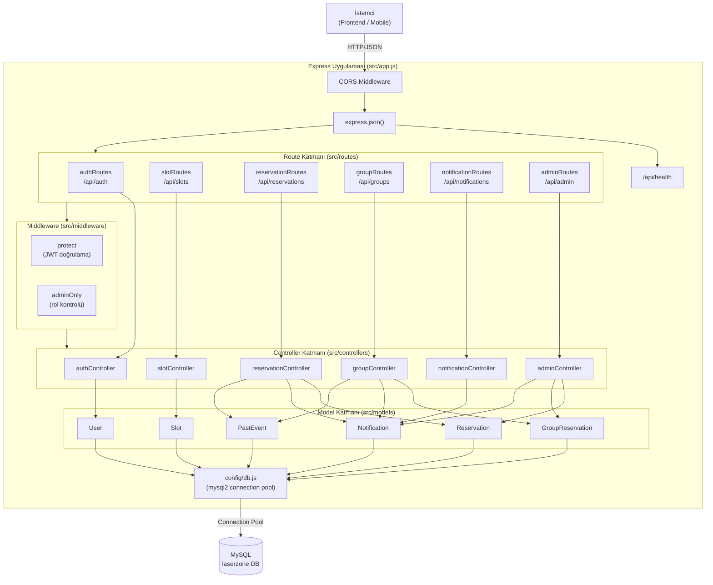
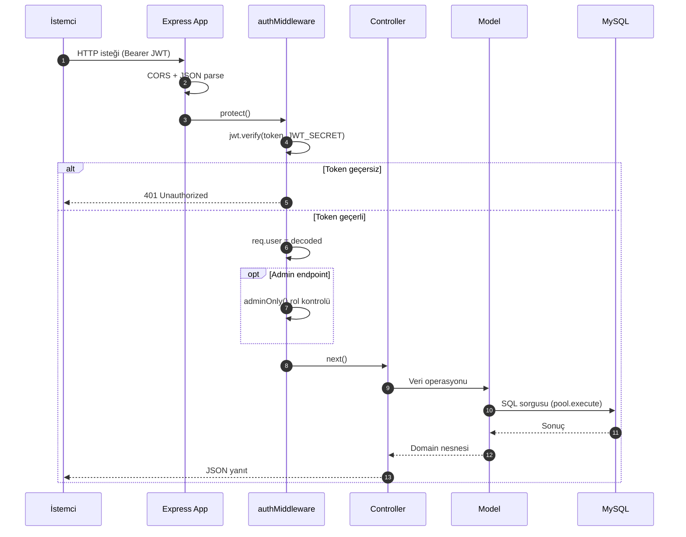
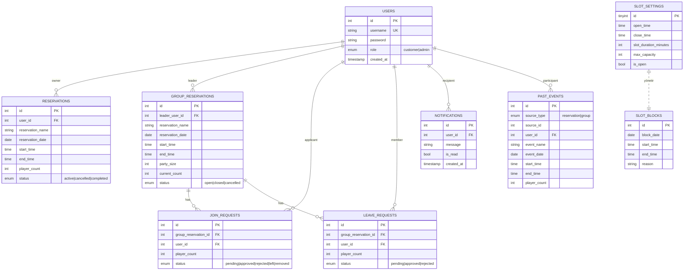
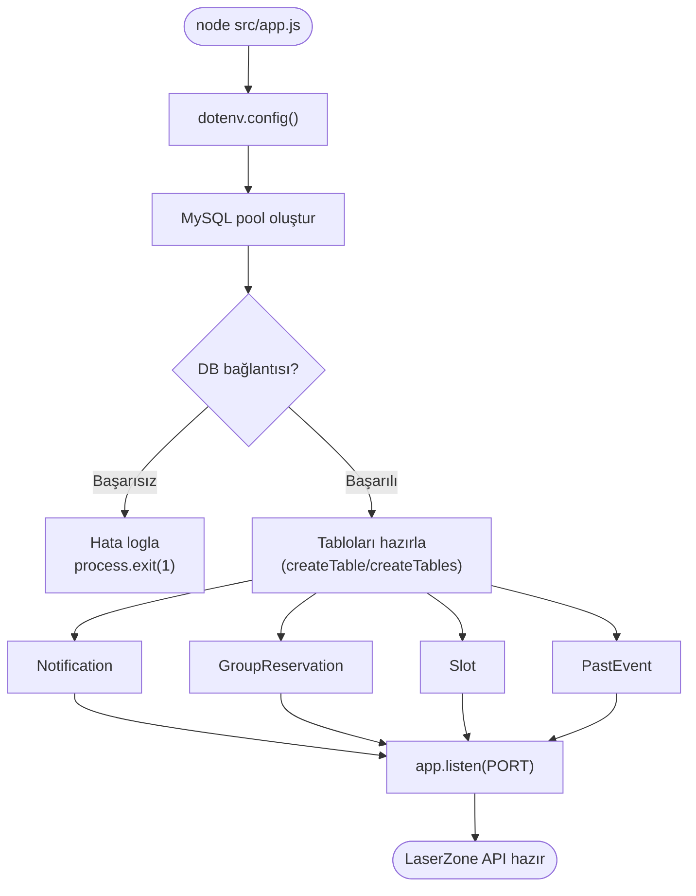

# LaserZone Backend — Mimari

LaserZone online rezervasyon sisteminin backend mimarisi. Node.js + Express + MySQL (mysql2) üzerine kurulmuş; JWT tabanlı kimlik doğrulama, rol-bazlı yetkilendirme (customer/admin) ve REST API katmanı kullanır.

## Katmanlı Mimari

## İstek Akışı (Request Flow)

## Domain Modeli (Veri İlişkileri)

## API Endpoint Haritası

```mermaid
flowchart LR
    API(("/api"))

    API --> Auth["/auth"]
    Auth --> A1["POST /register"]
    Auth --> A2["POST /login"]
    Auth --> A3["GET /me 🔒"]

    API --> Slots["/slots"]
    Slots --> S1["GET /availability"]
    Slots --> S2["GET /settings 🔒👑"]
    Slots --> S3["PUT /settings 🔒👑"]
    Slots --> S4["GET /blocks 🔒👑"]
    Slots --> S5["POST /blocks 🔒👑"]
    Slots --> S6["DELETE /blocks/:id 🔒👑"]

    API --> Res["/reservations"]
    Res --> RS1["POST / 🔒"]
    Res --> RS2["GET /my 🔒"]
    Res --> RS3["GET /history 🔒"]
    Res --> RS4["PUT /:id 🔒"]
    Res --> RS5["DELETE /:id 🔒"]

    API --> Groups["/groups"]
    Groups --> G1["POST / 🔒"]
    Groups --> G2["GET / 🔒"]
    Groups --> G3["GET /my 🔒"]
    Groups --> G4["GET /my-requests 🔒"]
    Groups --> G5["GET /:id 🔒"]
    Groups --> G6["PUT /:id 🔒"]
    Groups --> G7["DELETE /:id 🔒"]
    Groups --> G8["POST /:id/join 🔒"]
    Groups --> G9["POST /:id/leave 🔒"]
    Groups --> G10["GET /:id/requests 🔒"]
    Groups --> G11["PUT /:id/requests/:rid 🔒"]
    Groups --> G12["PUT /:id/leave-requests/:rid 🔒"]
    Groups --> G13["DELETE /:id/members/:uid 🔒"]

    API --> Notif["/notifications"]
    Notif --> N1["GET / 🔒"]
    Notif --> N2["PUT /read-all 🔒"]
    Notif --> N3["PUT /:id/read 🔒"]

    API --> Admin["/admin"]
    Admin --> AD1["GET /reservations 🔒👑"]
    Admin --> AD2["PUT /reservations/:id/approve 🔒👑"]
    Admin --> AD3["PUT /reservations/:id/cancel 🔒👑"]

    API --> Health["GET /health"]

    classDef public fill:#d4edda,stroke:#155724
    classDef auth fill:#fff3cd,stroke:#856404
    classDef admin fill:#f8d7da,stroke:#721c24

    class A1,A2,S1,Health public
    class A3,RS1,RS2,RS3,RS4,RS5,G1,G2,G3,G4,G5,G6,G7,G8,G9,G10,G11,G12,G13,N1,N2,N3 auth
    class S2,S3,S4,S5,S6,AD1,AD2,AD3 admin
```

**Legend:** 🔒 JWT zorunlu · 👑 Admin yetkisi zorunlu

## Boot Akışı (Uygulama Açılışı)

## Teknoloji Yığını

| Katman | Teknoloji |
|---|---|
| Runtime | Node.js |
| Web Framework | Express 4 |
| Veritabanı | MySQL (mysql2/promise) |
| Auth | JWT (jsonwebtoken) + bcryptjs |
| CORS | cors |
| Config | dotenv |
| Test | Jest + Supertest |
| Dev | nodemon |
